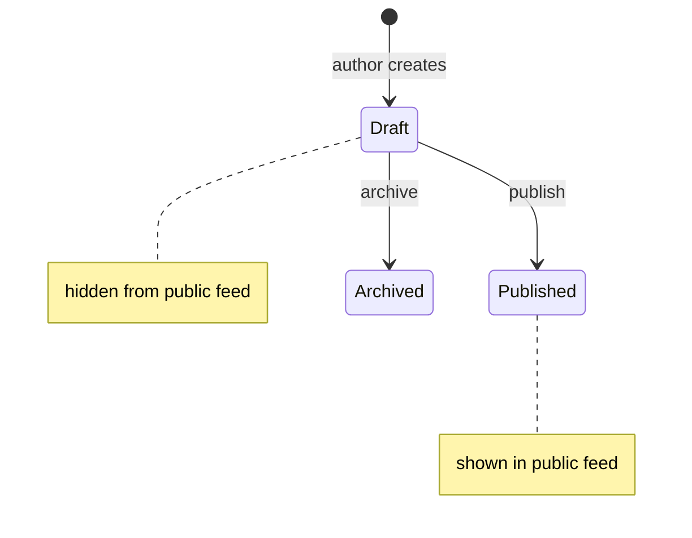

# Commits

- Commit locally, never push. `git commit && git push` counts as a push.
- Conventional Commits subject: `type(scope): summary`, scope optional
  (`feat(auth): add login redirect`). Types: feat, fix, refactor, docs,
  test, chore, perf, ci, build.
- One logical change per commit, in dependency order (model, plumbing,
  feature). Each commit leaves the tree working.
- Review feedback goes in a new commit on top. Amend only pre-review.
- Over 400 changed lines: split into a stack, per the `pr-stacks` skill.

# PR

Always `gh pr create --draft`. Use the repo's PR template when one exists and
map the sections below onto its headings. Drop template sections that do not
apply. Carry the ticket link and the links it contains.

```markdown
## Summary

<one sentence: what the user sees change, in product terms>

<one diagram of the mechanism>

- **<key term>:** <one sentence>
- **Out of scope:** <one sentence>

## Evidence

- **Before:** <screenshot or output from the running app>
  **After:** <screenshot or output from the running app>
```

Skip all preambles. Use the product's domain language.

## Summary

One effect sentence, one diagram, then bullets.

- **Effect sentence:** what changes for the user. "Unpublished posts stay
  out of the public feed until the author publishes."
- **Diagram:** the mechanism. A paragraph that explains how parts interact,
  which state leads where, or what happens in which order is a diagram not
  yet drawn: draw it, and the paragraph goes.
- **Bullets:** one **bold key term** and one sentence each: a choice that
  differs from the ticket, a constraint, a known gap, an out-of-scope
  follow-up. What needs more than a sentence is cut.

### Find the shape first

Name the shape of the change, then draw that shape. Done when every box,
arrow, and state carries a real name from the code or the product. GitHub
renders Mermaid in PR bodies.

| Shape of the change | Draw it as |
|---|---|
| Parts calling each other in order | Mermaid `sequenceDiagram` |
| States and the transitions between them | Mermaid `stateDiagram-v2`, with a note per state naming its product effect |
| A decision or a data flow with branches | Mermaid `flowchart` |
| Logic or an algorithm | Pseudocode |
| Structure that changes shape (tree, call stack, component tree) | `diff` of that tree |
| Who owns what after a refactor | Shallow file tree, one comment per folder |



```diff
 <SessionPage>
   useSessionEvents()
   <SessionToolbar>
+    <RunSkillButton />
   <SessionTimeline>
+    <SkillResultCard />
```

```diff
 src/
 ├── commands/
+│   └── show-me.ts       # expands the slash command
 ├── sessions/
-└── transport.ts
+└── transport/
+    ├── client.ts
+    └── stream.ts
```

The mechanism diagram leads. A `diff` of the call tree is the code map: add
it second, only when the reviewer needs it to find their way in the diff.
Two visuals is the ceiling.

## Evidence

Evidence is manual verification: what you did in a running app or shell to
see the change working, and what you saw. When the template has a "Manual
Testing" section, Evidence is that section, not a second one. Screenshots
go in a "Visuals" section when the template has one.

Screenshots when the change is visual. Otherwise the exact steps taken, or a
shell snippet (`./manage.py shell`, `rails console`) with its output. Proof
lives here, not in committed scripts.

Automated tests are not evidence: never list test suites, test runs, or "CI
passes" here, reviewers see them in the diff and in CI. When the change
cannot be verified manually (a pure refactor with no visible behaviour
change), write "Not manually testable" and say why.
