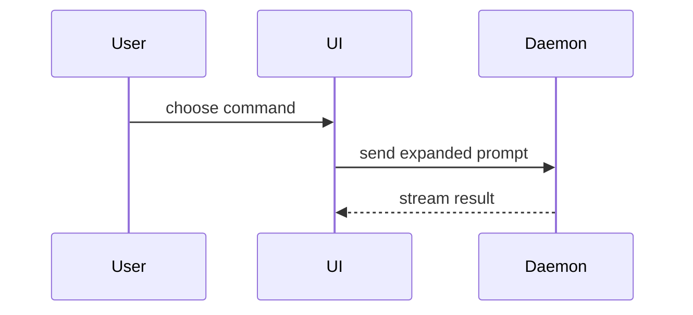

# PR body

Adapted from Matt Pocock's [`pr`](https://github.com/mattpocock/skills/tree/main/skills/engineering/pr)
skill (MIT). Its Summary visuals come from Dex Horthy's
[`show-me`](https://github.com/humanlayer/skills/blob/main/plugins/show-me/skills/show-me/SKILL.md).

When the repo has a PR template, keep its headings and map these three
sections onto them: Summary into the description heading, Evidence into the
testing heading, Merge Danger appended when the template has no risk
section. Without a template, use this layout as is:

```markdown
## Summary

<two or three sentences: the product problem and why the change exists>

<diagram, diff-sketch, or tree>

- <one bullet per change, one sentence each, at product altitude>

## Evidence

- **Before:** <screenshot/output/failing test run>
  **After:** <screenshot/output/passing test run>

## Merge Danger

**Door:** <one-way or two-way>

<optional: description>

**Blast Radius:** <one-word description>

<optional: potential ramifications of merge>
```

Skip all preambles and keep prose brief. Use the repo's `GLOSSARY.md` when
one exists, otherwise the product's established domain nouns.

## Summary

Pick the smallest view that makes the key point clear.

- Show logic or an algorithm as pseudocode:

```text
on(save)
  if content is unchanged
    return cached result
  write new content
  return fresh result
```

- Show runtime control flow as a call tree:

```text
submitForm
  createSession
    persistPrompt
    launchAgent
  navigateToSession
```

- Show UI structure as a component tree, including state and module
  boundaries that matter:

```text
<SessionPage> (apps/example/src/routes/session.tsx)
  useSessionEvents()
  <SessionToolbar>
    <RunSkillButton> (packages/ui)
```

- Show file responsibility or a broad refactor as a shallow file tree:

```text
src/
├── commands/       # parses user actions
├── sessions/       # owns session state
└── transport/      # sends API requests
```

- Show component interaction, control flow, or data flow with Mermaid:



- Use `diff` when the point is what changes and the surrounding shape
  already exists. Match the diff shape to the topic.

For a component change:

```diff
 <SessionPage>
   useSessionEvents()
   <SessionToolbar>
+    <RunSkillButton />
   <SessionTimeline>
+    <SkillResultCard />
```

For a file-layout change:

```diff
 src/
 ├── commands/
+│   └── show-me.ts       # expands the slash command
 ├── sessions/
-└── transport.ts
+└── transport/
+    ├── client.ts
+    └── stream.ts
```

For a call-tree or call-stack change:

```diff
 submitForm
   createSession
     persistPrompt
+    expandSkillMention
     launchAgent
-  navigateToSession
+  navigateToSession
+    subscribeToEvents
```

For a state or control-flow change:

```diff
 on(save)
-  write content
+  if content is unchanged
+    return cached result
+  write new content
+  invalidate cache
```

- Show the whole block when most of it is new, when omitted context would
  hide ownership or order, or when the reader needs a copyable target shape:

```ts
function expandSkill(command: string): string {
  const skillName = command.slice(1);
  return `use the ${skillName} skill`;
}
```

Place each visual next to the short text it supports. Keep only the calls,
files, props, states, and boundaries needed to make the point. One visual is
the norm, several is rare, all of them never.

## Evidence

Concrete proof that the change works, as a before and after. The proof goes
in the description, not in committed scripts.

- **Screenshots are S-tier** when the change is visual: capture the affected
  screens before and after.
- **Execution is A-tier**: a snippet to paste into the app's interactive
  shell (`./manage.py shell`, `rails console`) with its output, or a plain
  command (CLI task, curl, test invocation) with its output. Show the exact
  test that failed before and passes now.

## Merge Danger

- **Door**: two-way doors can be walked back, one-way doors cannot. A PR
  that is cheap to roll back is lower risk. Destructive actions and
  hard-to-reverse decisions (data migrations, deleted columns, public API
  changes) are one-way doors.
- **Blast Radius**: the potential scope of impact if the PR misbehaves.
  Consider every surface: layout shift, breakages for consumers, mobile
  responsiveness, background jobs, other teams' code paths.
